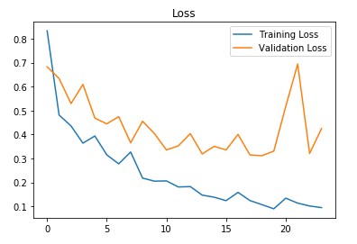

# Brain Tumor Detector - A Convolutional Neural Network Approach

This repository is dedicated to the development of a brain tumor detection model using a Convolutional Neural Network (CNN) implemented with Tensorflow and Keras. We have utilized a dataset of brain MRI images, which you can access [here](https://www.kaggle.com/navoneel/brain-mri-images-for-brain-tumor-detection).

## Dataset Overview

The dataset consists of two main folders: "positve" and "negative," encompassing a total of 253 Brain MRI images. The "positive" folder contains 155 images of brain MRIs with tumors, while the "negative" folder comprises 98 images without tumors.

## Data Augmentation

**Why Use Data Augmentation?**

Given the limited size of our dataset, challenges are faced in training the neural network effectively due to the scarcity of examples. Data augmentation proved to be a valuable technique for addressing both the small dataset size and data imbalance issues.

For a clearer understanding of our data augmentation process, refer to the "Data Augmentation" notebook.

Before data augmentation, the dataset was composed of:
- 155 positive examples (images with tumors)
- 98 negative examples (images without tumors)
- A total of 253 images

After data augmentation, our dataset expanded to:
- 1,085 positive examples
- 980 negative examples
- A total of 2,065 images

**Note:** It's important to mention that these 2,065 examples include the original 253 images, and they can be found in the "augmented" folder.

## Data Preprocessing

The following preprocessing steps are applied to each image in our dataset:

1. Cropped the part of the image containing only the brain, as it is the most critical region.
2. Resized the image to have a uniform shape of (240, 240, 3) to ensure consistency in input size for the neural network.
3. Applied normalization to scale pixel values within the range of 0-1.

## Data Split

The dataset was divided into three subsets:

1. 70% of the data for training.
2. 15% of the data for validation.
3. 15% of the data for testing.

# Neural Network Architecture

The design architecture follows these stages:


**Understanding the Architecture:**

Each input image (x) has a shape of (240, 240, 3) and traverses the neural network through the following layers:

1. A Zero Padding layer with a pool size of (2, 2).
2. A convolutional layer with 32 filters, using a filter size of (7, 7) and a stride of 1.
3. A batch normalization layer to normalize pixel values and accelerate computation.
4. A ReLU activation layer.
5. A Max Pooling layer with filter size (4, 4) and stride (4, 4).
6. A second Max Pooling layer with the same parameters.
7. A flatten layer to transform the 3-dimensional matrix into a one-dimensional vector.
8. A Dense (output unit) fully connected layer with a single neuron using a sigmoid activation, as it is a binary classification task.

**Why This Architecture?**

Initially, transfer learning was attempted using ResNet50 and VGG-16, but these models proved too complex for the dataset's size, leading to overfitting. A simpler architecture trained from scratch was used, which ultimately yielded successful results.

# Training the Model

The model underwent training for 24 epochs. Here are the loss and accuracy plots:




The highest validation accuracy was achieved during the 23rd iteration.

# Results

The best model, determined by its validation accuracy, successfully detects brain tumors with the following metrics on the test set:

- **88.7%** accuracy
- **0.88** F1 score

These results are impressive, especially considering the balanced nature of the dataset.

**Performance Summary of the Best Model:**

| Metrics   | Validation Set | Test Set   |
| --------- | -------------- | ---------- |
| Accuracy  | 91%            | 89%        |
| F1 Score  | 0.91           | 0.88       |


```python
from tensorflow.keras.models import load_model
best_model = load_model(filepath='models/cnn-parameters-improvement-23-0.91.model')
